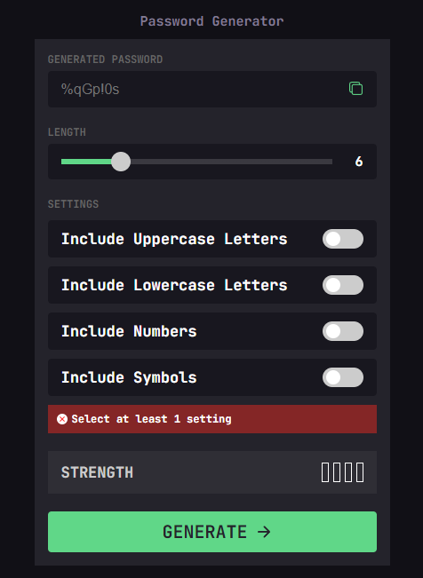

# Password generator app

An app that generates a password based on the settings chosen by the user, made with vanilla javaScript

## Table of contents

- [Overview](#overview)
  - [App features](#app-features)
  - [Screenshots](#screenshots)
  - [Links](#links)
- [My process](#my-process)
  - [Built with](#built-with)
  - [What I learned](#what-i-learned)
- [Author](#author)

## Overview

### App features

Users should be able to:

- Generate a password based on the selected inclusion options

- Copy the generated password to the computer's clipboard

- See a strength rating for their generated password

- View the optimal layout for the interface depending on their device's screen size

- See hover and focus states for all interactive elements on the page

### Screenshots

### With valid selections

### Password length error message

### Settings error message

### Copy to clipboard

### Links
- Live Site URL: [Password generator app](https://kiyomidev.github.io/password-generator-app/)

## My process

### Built with

- Semantic HTML5 markup
- CSS custom properties
- Flexbox
- Vanilla javaScript

### What I learned
- How to add custom styles to input range
- How to copy text to the clipboard with js

## Author
- Facebook - [@KiyomiDev0](https://www.facebook.com/KiyomiDev0)